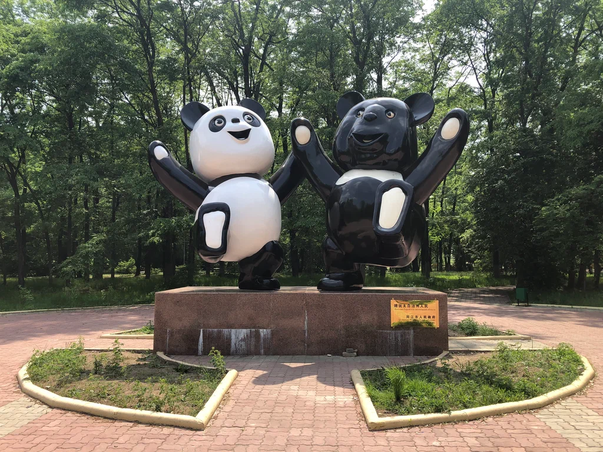

# Задание 2. Поиск координат по фото

## Задание

> Поздравляю, ты преодолел своё первое испытание, но путь предстоит длинный, так что не стоит расслабляться. Настоящий мастер должен уметь хорошо ориентироваться на местности, где бы он не находился. Тебе предстоит найти правильный ориентир и понять, куда же ты попал!

## Решение

С помощью простого поиска по картинке получаем место. Далее открываем Яндекс.Карты и берем координаты рядом с памятником.

## Ответ

`ninja{48.785,132.932}`
